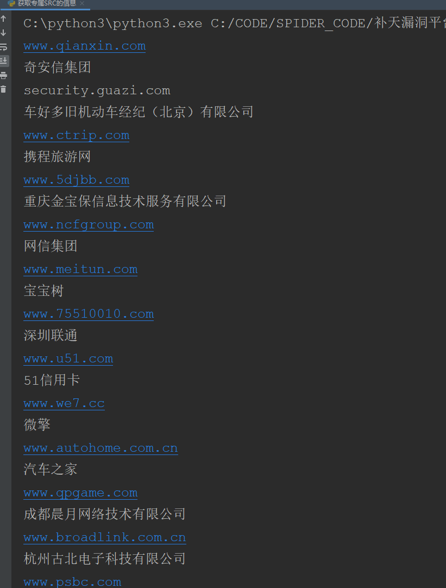
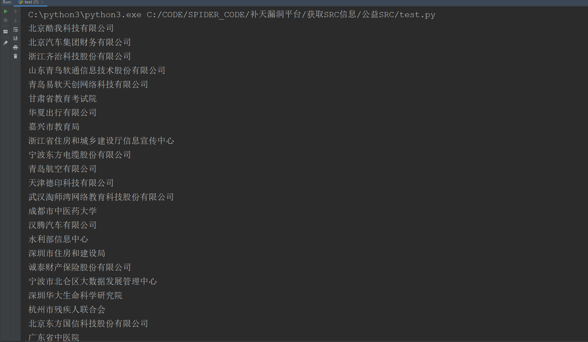
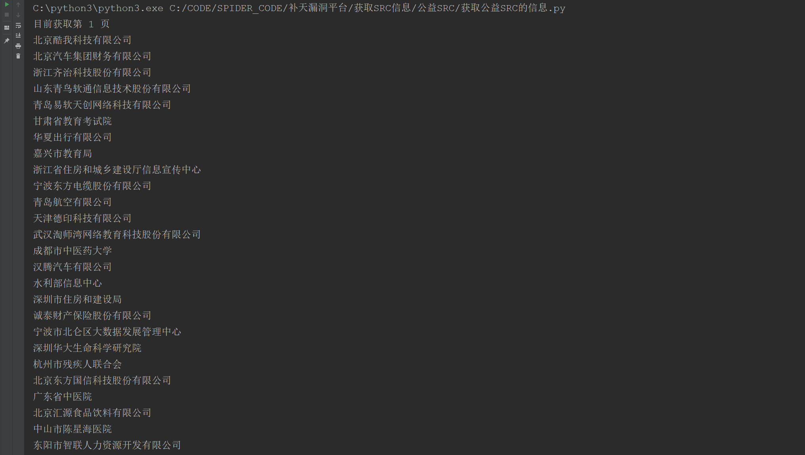

本文仅探讨对补天厂商信息的爬取，以及对数据的展示。

**本人技术菜，有些技术性如果错误，请大家指正。**

**本文大概需要花费2-5分钟时间阅读**

**Warning： 为了避免非零基础人群感到身体不适、头晕恶心、易怒及粗口，请不要查看以下内容。**

补天的厂商分为专属SRC,公益SRC，以及一些以及收录但是不展示出来的厂商，本文将对这三种厂商信息进行爬取，然后对补天的一些漏洞数据进行可视化展示。

# 专属 SRC

	专属 SRC 网址 : https://www.butian.net/Reward/plan

通过分析请求，发现数据是前端使用ajax动态获取

	专属 SRC 接口 ： https://www.butian.net/Reward/corps
	请求方式      ： POST
	请求参数      ：
					data = {
								's': '3',
								'p': '2',
								'sort': '2'
								}

获取的数据是json格式，其中具体的数据在

	jsons['data']['list']['host']            -->  域名
	jsons['data']['list']['company_name']    -->  企业名称

使用代码进行获取与解析

	import requests
	def parse_data(jsons):
	    datas = (jsons['data'])
	    real_data = (datas['list'])
	    for d in real_data:
	        print(d['host'])
	        print(d['company_name'])
			# 下面四行是保存数据，取消注释即可执行保存
        	# with open('企业域名.txt','a+',encoding='utf-8')as a:
	        #     a.write(d['host'].replace('www.','')+'\n')
	        # with open('企业名称.txt','a+',encoding='utf-8')as a:
	        #     a.write(d['company_name']+'\n')

	url = 'https://www.butian.net/Reward/corps'
	data = {
	's': '3',
	'p': '2',
	'sort': '2'
	}
	r = requests.post(url=url, data=data)
	parse_data(r.json())

返回结果：

然后将专属 SRC 的域名和企业名称保存即可，到这里补天的 专属 SRC 厂商信息获取完毕

# 公益 SRC

同上，先对公益 SRC 的信息进行探测，使用相同的方法得到公益 SRC 的接口

	公益 SRC 接口 : https://www.butian.net/Reward/pub
	请求方式      ： POST
	请求参数      ：
					data = {
								's': '1',
								'p': '1'
								}

获取的数据是json格式，其中具体的数据在

	jsons['data']['list']['company_name']    -->  企业名称

其中发现，通过修改 post 数据中的 p 参数，能够实现翻页功能，目前发现一共存在174页

可惜的是，在公益 SRC 提供的接口中，只有厂商的企业名称，并没有域名网址信息。

简单的尝试请求一下**第一页**获取数据：

	import requests
	def parse_data(jsons):
	    datas = (jsons['data'])
	    real_data = (datas['list'])
	    for d in real_data:
	        print(d['company_name'])
	url = 'https://www.butian.net/Reward/pub'
	data = {
	    's': '1',
	    'p': '1'
	}
	r = requests.post(url=url, data=data)
	parse_data(r.json())
	

返回结果：

可以获取到数据，接下来只需要循环一下，即可获取到所有的 公益 SRC 企业名称

使用代码：
	
	import requests
	def parse_data(jsons):
	    datas = (jsons['data'])
	    real_data = (datas['list'])
	    for d in real_data:
	        print(d['company_name'])
			# 下面两行的功能是保存数据，取消注释即可执行
	        # with open('企业名称.txt','a+',encoding='utf-8')as a:
	        #     a.write(d['company_name']+'\n')
	
	for i in range(1,175):
	    print('目前获取第 {} 页'.format(i))
	    url = 'https://www.butian.net/Reward/pub'
	    data = {
	        's': '1',
	        'p': i
	    }
	    r = requests.post(url=url, data=data)
	    try:
	        parse_data(r.json())
	    except Exception as e:
	        print(e)

返回结果：

需要注意的是，我这里并没有添加请求头headers，也没有设置cookie，但是补天并没有禁止我的数据爬取，如果出现获取不到信息，需要将自己的请求头和cookie添加进去，使用方法：

	import requests
	import re
	import time
	headers = {
	'Accept': 'application/json, text/javascript, */*; q=0.01',
	'Accept-Encoding': 'gzip, deflate, br',
	'Accept-Language': 'zh,zh-CN;q=0.9,en-US;q=0.8,en;q=0.7',
	'Connection': 'keep-alive',
	'Content-Length': '16',
	'Content-Type': 'application/x-www-form-urlencoded; charset=UTF-8',
	'Cookie': '这里改成你自己的cookie',
	'Host': 'www.butian.net',
	'Origin': 'https://www.butian.net',
	'Referer': 'https://www.butian.net/Reward/plan',
	'User-Agent': 'Mozilla/5.0 (Windows NT 10.0; Win64; x64) AppleWebKit/537.36 (KHTML, like Gecko) Chrome/71.0.3578.98 Safari/537.36',
	'X-Requested-With': 'XMLHttpRequest'
	
	}
	def parse_data(jsons):
	    datas = (jsons['data'])
	    real_data = (datas['list'])
	    for d in real_data:
	        print(d['company_name'])
			# 下面两行的功能是保存数据，取消注释即可执行
	        # with open('企业名称.txt','a+',encoding='utf-8')as a:
	        #     a.write(d['company_name']+'\n')
	
	for i in range(1,175):
	    print('目前获取第 {} 页'.format(i))
	    url = 'https://www.butian.net/Reward/pub'
	    data = {
	        's': '1',
	        'p': i
	    }
	    r = requests.post(url=url, data=data)
	    try:
	        parse_data(r.json())
	    except Exception as e:
	        print(e)

到这里 公益 SRC 爬取完毕

# 其他 厂商  爬取

补天还有一些厂商，并没有出现在 企业和公益 SRC 中，获取的方式也比较独特，个人认为是补天数据安全策略没有做好。

首先需要注册一个补天账号，然后进入提交漏洞页面

	提交网址 ： https://www.butian.net/Loo/submit

按 F12，进入调试界面

然后在厂商名称输入框，输入 1

查看请求

可以看到后端数过来的数据，其中数据都是 **企业名称或者域名中带 1 **的企业信息

尝试对请求进行分析：

	厂商 请求 接口  : https://www.butian.net/Home/Loo/getCompanyList
	请求方式       ： POST
	请求参数       ：
					data = {
								'token': 'b660ca4a609f28f575e8bb026e65cf706310cbbb',
								'company_name': '1'
								}

这里有两个地方必须要设置

第一个是请求头部分，这里需要cookie来伪装登陆状态

第二个是发送数据部分，这里需要这是口令token来确保每次请求的数据

获取的数据样式为：

获取的数据是json格式，其中具体的数据在

	jsons['data']['company']    -->  企业名称
	
	获取到的企业名称中，部分厂商返回的是 企业名称，另一部分返回的是厂商的域名
	所以要做判断

因为涉及到多次的发起请求，所以为了不触发补天的反爬虫策略，每次请求后，随机等待一段时间

使用代码：

	# -*- coding:utf-8 -*-
	#__author__:langzi
	#__blog__:www.langzi.fun
	import requests
	import time
	headers = {
	'Accept': 'application/json, text/javascript, */*; q=0.01',
	'Accept-Encoding': 'gzip, deflate, br',
	'Accept-Language': 'zh,zh-CN;q=0.9,en-US;q=0.8,en;q=0.7',
	'Connection': 'keep-alive',
	'Content-Length': '16',
	'Content-Type': 'application/x-www-form-urlencoded; charset=UTF-8',
	'Cookie':'这里修改成你的cookie',
	'Host': 'www.butian.net',
	'Origin': 'https://www.butian.net',
	'Referer': 'ttps://www.butian.net/Loo/submit',
	'User-Agent': 'Mozilla/5.0 (Windows NT 10.0; Win64; x64) AppleWebKit/537.36 (KHTML, like Gecko) Chrome/71.0.3578.98 Safari/537.36',
	'X-Requested-With': 'XMLHttpRequest'
	
	}
	def parse_data(jsons):
	    data1 = jsons['data']
	    print('总数量为:{}'.format(len(data1)))
	    for i in data1:
	        print(i['company'])
			# 下面注释的是保存数据，取消注释即可保存
	        # if i['company'].count('.')>1:
	        #     with open('srcname技巧寻找.txt', 'a+', encoding='utf-8')as a:
	        #         a.write(i['company'] + '\n')
	        # else:
	        #     with open('企业名称技巧寻找.txt','a+',encoding='utf-8')as a:
	        #         a.write(i['company']+'\n')
	
	import string
	num = list(range(10))
	strs = [x for x in string.ascii_lowercase]
	keys = ['有限公司', '人力资源', '学院', '保障局', '人民政府', '职业', '管理局', '委员会', '集团', '股份', '科技', '社会', '北京', '技术', '平台', '中国', '财产保险', '信息网', '卫生', '社会保障', '有限公司', '学院', '人民政府', '科技', '职业', '集团', '委员会', '中国', '北京', '信息网', '股份', '技术', '上海', '教育', '平台', '管理局', '人才网', '服务网', '大学', '网站', '有限公司', '学院', '人民政府', '职业', '科技', '集团', '委员会', '管理局', '技术', '信息网', '中国', '北京', '平台', '教育', '大学', '股份', '上海', '人力资源', '网络科技', '人才网']
	keys = list(set(keys))
	shenfen = ['北京','天津','河北','山西','内蒙古','辽宁','吉林','黑龙江','上海','江苏','浙江','安徽','福建','江西','山东','河南','湖北','湖南','广东','广西','海南','重庆','四川','贵州','云南','西藏','陕西','甘肃','青海','宁夏','新疆','台湾','香港','澳门']
	citys = ['朝阳区','海淀区','通州区','房山区','丰台区','昌平区','大兴区','顺义区','西城区','延庆县','石景山区','宣武区','怀柔区','崇文区','密云县','东城区','门头沟区','平谷区','东莞市','广州市','中山市','深圳市','惠州市','江门市','珠海市','汕头市','佛山市','湛江市','河源市','肇庆市','潮州市','清远市','韶关市','揭阳市','阳江市','云浮市','茂名市','梅州市','汕尾市','山东省','济南市','青岛市','临沂市','济宁市','菏泽市','烟台市','泰安市','淄博市','潍坊市','日照市','威海市','滨州市','东营市','聊城市','德州市','莱芜市','枣庄市','江苏省','苏州市','徐州市','盐城市','无锡市','南京市','南通市','连云港市','常州市','扬州市','镇江市','淮安市','泰州市','宿迁市','河南省','郑州市','南阳市','新乡市','安阳市','洛阳市','信阳市','平顶山市','周口市','商丘市','开封市','焦作市','驻马店市','濮阳市','三门峡市','漯河市','许昌市','鹤壁市','济源市','上海市','松江区','宝山区','金山区','嘉定区','南汇区','青浦区','浦东新区','奉贤区','闵行区','徐汇区','静安区','黄浦区','普陀区','杨浦区','虹口区','闸北区','长宁区','崇明县','卢湾区','河北省','石家庄市','唐山市','保定市','邯郸市','邢台市','河北区','沧州市','秦皇岛市','张家口市','衡水市','廊坊市','承德市','浙江省','温州市','宁波市','杭州市','台州市','嘉兴市','金华市','湖州市','绍兴市','舟山市','丽水市','衢州市','香港特别行政区','陕西省','西安市','咸阳市','宝鸡市','汉中市','渭南市','安康市','榆林市','商洛市','延安市','铜川市','湖南省','长沙市','邵阳市','常德市','衡阳市','株洲市','湘潭市','永州市','岳阳市','怀化市','郴州市','娄底市','益阳市','张家界市','湘西州','重庆市','江北区','渝北区','沙坪坝区','九龙坡区','万州区','永川市','南岸区','酉阳县','北碚区','涪陵区','秀山县','巴南区','渝中区','石柱县','忠县','合川市','大渡口区','开县','长寿区','荣昌县','云阳县','梁平县','潼南县','江津市','彭水县','璧山县','綦江县','大足县','黔江区','巫溪县','巫山县','垫江县','丰都县','武隆县','万盛区','铜梁县','南川市','奉节县','双桥区','城口县','福建省','漳州市','泉州市','厦门市','福州市','莆田市','宁德市','三明市','南平市','龙岩市','天津市','和平区','北辰区','河北区','河西区','西青区','津南区','东丽区','武清区','宝坻区','红桥区','大港区','汉沽区','静海县','宁河县','塘沽区','蓟县','南开区','河东区','云南省','昆明市','红河州','大理州','文山州','德宏州','曲靖市','昭通市','楚雄州','保山市','玉溪市','丽江地区','临沧地区','思茅地区','西双版纳州','怒江州','迪庆州','四川省','成都市','绵阳市','广元市','达州市','南充市','德阳市','广安市','阿坝州','巴中市','遂宁市','内江市','凉山州','攀枝花市','乐山市','自贡市','泸州市','雅安市','宜宾市','资阳市','眉山市','甘孜州','广西壮族自治区','贵港市','玉林市','北海市','南宁市','柳州市','桂林市','梧州市','钦州市','来宾市','河池市','百色市','贺州市','崇左市','防城港市','安徽省','芜湖市','合肥市','六安市','宿州市','阜阳市','安庆市','马鞍山市','蚌埠市','淮北市','淮南市','宣城市','黄山市','铜陵市','亳州市','池州市','巢湖市','滁州市','海南省','三亚市','海口市','琼海市','文昌市','东方市','昌江县','陵水县','乐东县','五指山市','保亭县','澄迈县','万宁市','儋州市','临高县','白沙县','定安县','琼中县','屯昌县','江西省','南昌市','赣州市','上饶市','吉安市','九江市','新余市','抚州市','宜春市','景德镇市','萍乡市','鹰潭市','湖北省','武汉市','宜昌市','襄樊市','荆州市','恩施州','孝感市','黄冈市','十堰市','咸宁市','黄石市','仙桃市','随州市','天门市','荆门市','潜江市','鄂州市','神农架林区','山西省','太原市','大同市','运城市','长治市','晋城市','忻州市','临汾市','吕梁市','晋中市','阳泉市','朔州市','辽宁省','大连市','沈阳市','丹东市','辽阳市','葫芦岛市','锦州市','朝阳市','营口市','鞍山市','抚顺市','阜新市','本溪市','盘锦市','铁岭市','台湾省','台北市','高雄市','台中市','新竹市','基隆市','台南市','嘉义市','黑龙江','齐齐哈尔市','哈尔滨市','大庆市','佳木斯市','双鸭山市','牡丹江市','鸡西市','黑河市','绥化市','鹤岗市','伊春市','大兴安岭地区','七台河市','内蒙古自治区','赤峰市','包头市','通辽市','呼和浩特市','乌海市','鄂尔多斯市','呼伦贝尔市','兴安盟','巴彦淖尔盟','乌兰察布盟','锡林郭勒盟','阿拉善盟','澳门特别行政区','贵州省','贵阳市','黔东南州','黔南州','遵义市','黔西南州','毕节地区','铜仁地区','安顺市','六盘水市','甘肃省','兰州市','天水市','庆阳市','武威市','酒泉市','张掖市','陇南地区','白银市','定西地区','平凉市','嘉峪关市','临夏回族自治州','金昌市','甘南州','青海省','西宁市','海西州','海东地区','海北州','果洛州','玉树州','黄南藏族自治州','新疆维吾尔自治区','乌鲁木齐市','伊犁州','昌吉州','石河子市','哈密地区','阿克苏地区','巴音郭楞州','喀什地区','塔城地区','克拉玛依市','和田地区','阿勒泰州','吐鲁番地区','阿拉尔市','博尔塔拉州','五家渠市','克孜勒苏州','图木舒克市','西藏区','拉萨市','山南地区','林芝地区','日喀则地区','阿里地区','昌都地区','那曲地区','吉林省','吉林市','长春市','白山市','白城市','延边州','松原市','辽源市','通化市','四平市','宁夏回族自治区','银川市','吴忠市','中卫市','石嘴山市','固原市']
	
	all_data = []
	all_data.extend(num)
	all_data.extend(strs)
	all_data.extend(keys)
	all_data.extend(shenfen)
	all_data.extend(citys)
	
	import random
	def run(keyword):
	    print('当前关键词为:{}'.format(keyword))
	    time.sleep(random.randint(1,5))
	    url = 'https://www.butian.net/Home/Loo/getCompanyList'
	    data = {
	        'token': 'b660ca4a609f28f575e8bb026e65cf706310cbbb',
	        'company_name': keyword
	    }
	    r = requests.post(url=url, data=data,headers=headers)
	    try:
	        parse_data(r.json())
	    except Exception as e:
	        print(e)
	        time.sleep(20)
	for k in all_data:
	    run(str(k).replace('省','').replace('市','').replace('区',''))
	
		
		

还有一种就是通过补天的历史漏洞页面，获取哪些已经通过了的厂商

这里分析了一下，发现接口数据

	厂商 请求 接口  : https://www.butian.net/Loo/index/p/1
	请求方式       ： GET
	请求参数       ： URL 请求中末尾可以修改页数实现跳转

获取的数据是json格式，其中具体的数据在

	jsons['data']['list']['title']    -->  企业名称
	
	获取到的名称中，格式为：带头大哥发现了 d1优尚 的一个逻辑漏洞漏洞
	想要获取到企业名称只需要进行数据获取即可

	jsons['data']['list']['title'].replace('发现了','').split('的')[0]    -->  企业名称

一共发现有 6293 页，使用代码获取厂商名，因为页数比较多，所以使用线程池进行快速获取，线程池数量设置为10

使用代码：

	# -*- coding:utf-8 -*-
	import requests
	from concurrent.futures import ThreadPoolExecutor
	import time
	import random
	def run(url):
	    try:
	        time.sleep(random.randint(1,3))
	        r = requests.get(url,timeout=5)
	        print('当前爬行到第{}页'.format(url.replace('https://www.butian.net/Loo/index/p/', '')))
	        data = (r.json()['data']['list'])
	        for i in data:
	            print(i['title'].replace('发现了','').split('的')[0])
	            # 下面两行是保存数据
	            with open('厂商.txt','a+',encoding='utf-8')as a:
	                a.write(str(i['title'].replace('发现了','').split('的')[0])+ '\n')
	    except Exception as e:
	        print(e)
	        run(url)
	if __name__ == '__main__':
	    tasks = ['https://www.butian.net/Loo/index/p/{}'.format(id) for id in range(1,6293)]
	    with ThreadPoolExecutor(10) as p:
	        res= [p.submit(run,url) for url in tasks]

有些厂商名重复，不过不要紧，到时候直接去重复就好了

# 整理汇总

目前一共通过 4 种方法获取到了大量的补天厂商信息，接下来尝试对厂商列表去重复处理

去重后，数据如下，期间可能有一些是失误的数据，不过影响不大

期间还获取到 专属 SRC 有 41 个域名，这些域名可以做批量的爆破获取更多的子域名，并且通过第三种方式也获取到接近一万的网址域名，但是这些域名并没有http或者https，尝试对这些域名验证检测使用http还是https，并且包括之前批量爆破了一批 src 的网址，也一起放进来吧

首先新建一个 urls.txt ，把所有获取到的域名网址保存在其中，然后执行下面的 py 代码

	# coding:utf-8
	with open('不带http的.txt','a+')as a:
		a.writelines(filter(lambda x:'http' not in x ,[x.lstrip() for x in list(set(open('URLS.txt','r').readlines()))]))

和

	# coding:utf-8
	with open('带http的.txt','a+')as a:
		a.writelines(filter(lambda x:'http'  in x ,[x.lstrip() for x in list(set(open('URLS.txt','r').readlines()))]))

然后继续运行下面的 py 代码,功能是判断url是http还是https

	# -*- coding:utf-8 -*-
	#__author__:langzi
	#__blog__:www.langzi.fun
	import asyncio
	import aiofiles
	import aiomultiprocess
	import aiohttp
	
	from urllib.parse import urlparse
	import multiprocessing
	
	from concurrent.futures import ThreadPoolExecutor
	headers = {'User-Agent': 'Mozilla/5.0 (Windows NT 10.0; Win64; x64) AppleWebKit/537.36 (KHTML, like Gecko) Chrome/68.0.3440.106 Safari/537.36'}
	
	async def run(url):
	    print('Scan:'+url)
	    async with asyncio.Semaphore(1000):
	        async with aiohttp.ClientSession(connector=aiohttp.TCPConnector(verify_ssl=False)) as session:
	            try:
	                async with session.get('http://'+url,timeout=15) as resp:
	                    if resp.status == 200 or resp.status == 301 or resp.status == 302 or resp.status == 404:
	                        u = urlparse(str(resp.url))
	                        async with aiofiles.open('alive.txt', 'a+',encoding='utf-8')as f:
	                            await f.write(u.scheme+'://'+u.netloc+'\n')
	                        return
	            except Exception as e:
	                pass
	
	        #async with aiohttp.ClientSession(connector=aiohttp.TCPConnector(verify_ssl=False)) as session:
	            try:
	                async with session.get('https://' + url,timeout=15) as resp:
	                    if resp.status == 200 or resp.status == 301 or resp.status == 302 or resp.status == 404:
	                        u = urlparse(str(resp.url))
	                        async with aiofiles.open('alive.txt', 'a+', encoding='utf-8')as f:
	                            await f.write(u.scheme + '://' + u.netloc + '\n')
	                        return
	            except Exception as e:
	                #print(e)
	                pass
	
	
	async def main(urls):
	    async with aiomultiprocess.Pool() as pool:
	        await pool.map(run, urls)
	
	
	if __name__ == '__main__':
	    multiprocessing.freeze_support()
	    inp = '不带http的.txt'
	    urls = list(set([x.rstrip('/').strip() for x in open(inp, 'r', encoding='utf-8').readlines()]))
	    print('目标数量:'+str(len(urls)))
	    loop = asyncio.get_event_loop()
	    loop.run_until_complete(main(urls))

随后尝试使用百度搜索引擎批量获取到 **企业名称对应的域名**

使用代码：
	
	# -*- coding:utf-8 -*-
	#__author__:langzi
	#__blog__:www.langzi.fun
	import requests
	import re
	from concurrent.futures import ThreadPoolExecutor
	from urllib.parse import quote,urlparse
	from bs4 import BeautifulSoup as bs
	from requests.packages import urllib3
	urllib3.disable_warnings()
	
	def Check_Keyword(url,keyword):
	    headers = {
	        'Accept': 'text/html,application/xhtml+xml,application/xml;q=0.9,image/webp,image/apng,*/*;q=0.8',
	        'User-Agent': 'Mozilla/5.0 (Windows NT 10.0; Win64; x64) AppleWebKit/537.36 (KHTML, like Gecko) Chrome/71.0.3578.98 Safari/537.36'
	    }
	    try:
	        r = requests.get(url,headers=headers,timeout=20,verify=False)
	        encoding = requests.utils.get_encodings_from_content(r.text)[0]
	        content = r.content.decode(encoding,'replace')
	        if keyword in content:
	            return True
	        else:
	            return False
	    except:
	        return False
	
	
	def scan(keywords):
	    result = set()
	    for page in range(0,30,10):
	        # 只需要 5 页 的数据就够了
	        url = 'https://www.baidu.com/s?wd={}&pn={}'.format(quote(keywords),page)
	        try:
	            headers = {
	            'Accept': 'text/html,application/xhtml+xml,application/xml;q=0.9,image/webp,image/apng,*/*;q=0.8',
	            'Accept-Encoding': 'gzip, deflate, br',
	            'Accept-Language': 'zh,en-US;q=0.9,en;q=0.8,zh-CN;q=0.7',
	            'Cache-Control': 'max-age=0',
	            'Connection': 'keep-alive',
	            'Cookie': 'BAIDUID=832CF61CDAEF34C68E7CA06F591DF82A:FG=1; BIDUPSID=832CF61CDAEF34C68E7CA06F591DF82A; PSTM=1544962484; BD_UPN=12314753; BDUSS=RWclRJUURtR25qZWxKZWZiN0JuSlJVTWpKRjhvb3ROdmIyNnB0eEwwY2FVOWxjSVFBQUFBJCQAAAAAAAAAAAEAAADS9fNj0-~PxM600esAAAAAAAAAAAAAAAAAAAAAAAAAAAAAAAAAAAAAAAAAAAAAAAAAAAAAAAAAAAAAAAAAAAAAAAAAABrGsVwaxrFcck; cflag=13%3A3; BDORZ=B490B5EBF6F3CD402E515D22BCDA1598; BD_HOME=1; delPer=0; BDRCVFR[feWj1Vr5u3D]=mk3SLVN4HKm; H_PS_PSSID=1453_21088_20692_28774_28720_28558_28832_28584; B64_BOT=1; BD_CK_SAM=1; PSINO=1; sug=3; sugstore=1; ORIGIN=2; bdime=0; H_PS_645EC=87ecpN5CzJjR5UwprsIowJPhqh6m9t1xGvxRkjeNmvcXBhI86ytKIjXLMhQ',
	            'Host': 'www.baidu.com',
	            'Upgrade-Insecure-Requests': '1',
	            'User-Agent': 'Mozilla/5.0 (Windows NT 10.0; Win64; x64) AppleWebKit/537.36 (KHTML, like Gecko) Chrome/71.0.3578.98 Safari/537.36'
	
	            }
	            r = requests.get(url,headers=headers,timeout=20)
	            soup = bs(r.content, 'lxml')
	            # 如果报错，就把上面这行 改成 soup = bs(r.content, 'html.parse')
	            urls = soup.find_all(name='a', attrs={'data-click': re.compile(('.')), 'class': None})
	            for url_ in urls:
	                r_ = requests.get(url=url_['href'], headers=headers, timeout=20)
	                if r_.status_code == 200 or r_.status_code == 302:
	                    u = urlparse(r_.url)
	                    ur = u.scheme+'://'+u.netloc
	                    result.add(ur)
	        except Exception as e:
	            pass
	    if result != {}:
	        for ur in result:
	            res = Check_Keyword(ur, keywords)
	            if res == True:
	                print('当前关键词获取成功:{} 对应网址: {} '.format(keywords, ur))
	                with open('url_result.txt','a+',encoding='utf-8')as a:
	                    a.write(ur + '\n')
	                with open('url_log.txt','a+',encoding='utf-8')as a:
	                    a.write(keywords + ':' + ur + '\n')
	
	if __name__ == '__main__':
	    inp = input('导入标题文本:')
	    titles = list(set([x.strip() for x in open(inp,'r',encoding='utf-8').readlines()]))
	    print('目标总数:{}'.format(len(titles)))
	    with ThreadPoolExecutor(10) as p:
	        # 开 10 个线程池
	        res = [p.submit(scan,url) for url in titles]

# 数据展示

对 补天 通过的历史漏洞进行可视化处理，首先进行数据获取

还是使用代码：

	# -*- coding:utf-8 -*-
	import requests
	from concurrent.futures import ThreadPoolExecutor
	import time
	import random
	def run(url):
	    try:
	        time.sleep(random.randint(1,3))
	        r = requests.get(url,timeout=5)
	        data = (r.json()['data']['list'])
	        for i in data:
	            title, vlun = (i['title'].replace('发现了', '').replace('一个', '').split('的'))
	            res = (title, vlun, i['datetime'], i['level'])
	            print(res)
	            with open('厂商.txt','a+',encoding='utf-8')as a:
	                a.write(str(res)+ '\n')
	    except Exception as e:
	        print(e)
	        run(url)
	if __name__ == '__main__':
	    tasks = ['https://www.butian.net/Loo/index/p/{}'.format(id) for id in range(1,6293)]
	    with ThreadPoolExecutor(10) as p:
	        res= [p.submit(run,url) for url in tasks]
	

保存的数据格式如下：

然后使用jieba分词对数据处理后，使用pyecharts进行可视化

	# -*- coding:utf-8 -*-
	import requests
	import re
	import random
	import datetime
	import time
	from pyecharts import WordCloud,Bar
	from collections import Counter
	import jieba.analyse
	import copy
	
	def run_wordcloud(name,value,types):
	    wordcloud = WordCloud(title=types,width=1500,height=1000)
	    wordcloud.add("", name, value, word_size_range=[20, 100])
	    wordcloud.render(types+'.html')
	
	def run_bar(name,value,types):
	    bar = Bar(title=types)
	    bar.use_theme('light')
	    bar.add('漏洞数量', name, value, is_more_utils=True)
	    # 添加数据,数据一般为两个列表（长度一致）。如果你的数据是字典或者是带元组的字典。可利用cast()方法转换,is_more_utils可以选择数据的显示方式
	    bar.render(types+'.html')
	    # 生成本地html文件
	
	def main(datas,types,langzi):
	    if langzi == 'wc':
	        low_datas = Counter(datas).most_common(50)
	        low_name  = [x[0] for x in low_datas]
	        low_value = [x[1] for x in low_datas]
	        run_wordcloud(low_name,low_value,types)
	    if langzi == 'bar':
	        name_bar = list(datas.keys())
	        value_bar = list(datas.values())
	        run_bar(name_bar,value_bar,types)
	
	
	
	if __name__ == '__main__':
	    data = [x.strip() for x in open('result.txt','r',encoding='utf-8').readlines()]
	    jieba_wc = {'低危漏洞': [], '中危漏洞': [], '高危漏洞': [],
	                '低危公司': [], '中危公司': [], '高危公司': []}
	    low_company,mid_company,hig_company = [],[],[]
	    # 漏洞公司名称
	    for x in data:
	        _ = eval(x)
	        if _[2] == '低危':
	            jieba_wc['低危漏洞'].append(_[1])
	            jieba_wc['低危公司'].append(_[0])
	        if _[2] == '中危':
	            jieba_wc['中危漏洞'].append(_[1])
	            jieba_wc['中危公司'].append(_[0])
	        if _[2] == '高危':
	            jieba_wc['高危漏洞'].append(_[1])
	            jieba_wc['高危公司'].append(_[0])
	
	    main(jieba_wc['低危漏洞'],'词云版本_低危漏洞','wc')
	    main(jieba_wc['中危漏洞'],'词云版本_中危漏洞','wc')
	    main(jieba_wc['高危漏洞'],'词云版本_高危漏洞','wc')
	
	
	    #print(jieba.analyse.extract_tags(''.join(jieba_wc['低危公司'])))
	    #print(jieba.analyse.extract_tags(''.join(jieba_wc['中危公司'])))
	    #print(jieba.analyse.extract_tags(''.join(jieba_wc['高危公司'])))
	    # 打印不同等级的关键词
	
	
	    key_words = (jieba.analyse.extract_tags(''.join(jieba_wc['高危公司'])))+(jieba.analyse.extract_tags(''.join(jieba_wc['中危公司'])))+(jieba.analyse.extract_tags(''.join(jieba_wc['低危公司'])))
	
	    print(key_words)
	    # 打印所有的关键词
	    jieba_bar = dict.fromkeys(key_words,0)
	    for key_word in key_words:
	        for x in data:
	            _ = eval(x)
	            if key_word in _[0]:
	                jieba_bar[key_word] += 1
	            # 所有关键词分类
	            # if _[2] == '高危':
	            # #如果按照不同等级分类，这里可以设置 低中高 等级
	            #     if key_word in _[0]:
	            #         jieba_bar[key_word] +=1
	
	    #main(jieba_bar,'所有关键词漏洞网址','bar')

获取到数据后，尝试根据分词提取出【漏洞公司】的名称关键词，根据漏洞的【危害程度】进行分类：

	【低危漏洞的网站关键词】：['有限公司', '学院', '人民政府', '职业', '科技', '集团', '委员会', '管理局', '技术', '信息网', '中国', '北京', '平台', '教育', '大学', '股份', '上海', '人力资源', '网络科技', '人才网']
	【中危漏洞的网站关键词】：['有限公司', '学院', '人民政府', '科技', '职业', '集团', '委员会', '中国', '北京', '信息网', '股份', '技术', '上海', '教育', '平台', '管理局', '人才网', '服务网', '大学', '网站']
	【高危漏洞的网站关键词】：['有限公司', '人力资源', '学院', '保障局', '人民政府', '职业', '管理局', '委员会', '集团', '股份', '科技', '社会', '北京', '技术', '平台', '中国', '财产保险', '信息网', '卫生', '社会保障']

对这些关键词做汇总，毕竟这些网站关键词都通过漏洞验证：

	【所有关键词】：['有限公司', '人力资源', '学院', '保障局', '人民政府', '职业', '管理局', '委员会', '集团', '股份', '科技', '社会', '北京', '技术', '平台', '中国', '财产保险', '信息网', '卫生', '社会保障', '有限公司', '学院', '人民政府', '科技', '职业', '集团', '委员会', '中国', '北京', '信息网', '股份', '技术', '上海', '教育', '平台', '管理局', '人才网', '服务网', '大学', '网站', '有限公司', '学院', '人民政府', '职业', '科技', '集团', '委员会', '管理局', '技术', '信息网', '中国', '北京', '平台', '教育', '大学', '股份', '上海', '人力资源', '网络科技', '人才网']

提取出关键词后，尝试对这些数据做可视化，跟加简单直观的获取到【不同关键词对应的漏洞等级】：

低危漏洞：

	 	漏洞数量
	有限公司	3120
	人力资源	178
	学院	1890
	保障局	56
	人民政府	981
	职业	882
	管理局	573
	委员会	663
	集团	1068
	股份	738
	科技	1344
	社会	106
	北京	900
	技术	1182
	平台	624
	中国	1260
	财产保险	4
	信息网	318
	卫生	76
	社会保障	71
	上海	452
	教育	616
	人才网	116
	服务网	40
	大学	936
	网站	112
	网络科技	66

中危漏洞：

	 	漏洞数量
	有限公司	6663
	人力资源	260
	学院	3369
	保障局	76
	人民政府	1878
	职业	1509
	管理局	789
	委员会	1215
	集团	2160
	股份	1680
	科技	2655
	社会	150
	北京	1620
	技术	2121
	平台	993
	中国	2448
	财产保险	12
	信息网	573
	卫生	117
	社会保障	99
	上海	960
	教育	930
	人才网	256
	服务网	105
	大学	1544
	网站	281
	网络科技	99

高危漏洞：

	 	漏洞数量
	有限公司	3099
	人力资源	596
	学院	1344
	保障局	197
	人民政府	675
	职业	699
	管理局	822
	委员会	780
	集团	969
	股份	1023
	科技	999
	社会	337
	北京	810
	技术	942
	平台	603
	中国	1038
	财产保险	75
	信息网	246
	卫生	139
	社会保障	287
	上海	350
	教育	394
	人才网	76
	服务网	38
	大学	544
	网站	70
	网络科技	51

【图片*6】

可以直观的看到，【有限公司，学校，集团，技术，中国，人民政府】这几个关键词遥遥领先，也就是说：

	这些关键词的网址，提交容易被审核通过

接下来查看【根据危害程度】的漏洞种类。因为漏洞种类是固定的，漏洞公司数量太大，所以漏洞种类可以使用【词云】来展示，结果更加直观。

低危漏洞：

	series0
	信息泄露漏洞	2022
	弱口令漏洞	1975
	SQL注入漏洞	1362
	命令执行漏洞	1103
	逻辑漏洞	363
	权限绕过漏洞	247
	任意文件操作漏洞	211
	代码执行漏洞	161
	XSS漏洞	158
	疑似被黑漏洞	119
	文件包含漏洞	84
	入侵事件漏洞	39
	文件上传漏洞	27
	存在后门漏洞	26
	解析漏洞漏洞	8
	智能硬件漏洞	1

中危漏洞：

	series0
	SQL注入漏洞	7789
	命令执行漏洞	1823
	弱口令漏洞	1330
	信息泄露漏洞	824
	逻辑漏洞	557
	XSS漏洞	460
	任意文件操作漏洞	373
	权限绕过漏洞	340
	代码执行漏洞	222
	文件上传漏洞	81
	入侵事件漏洞	58
	文件包含漏洞	48
	存在后门漏洞	18
	疑似被黑漏洞	14
	解析漏洞漏洞	4
	智能硬件漏洞	2

高危漏洞：

	series0
	命令执行漏洞	2088
	SQL注入漏洞	1582
	弱口令漏洞	910
	代码执行漏洞	855
	文件上传漏洞	489
	信息泄露漏洞	424
	入侵事件漏洞	162
	逻辑漏洞	147
	权限绕过漏洞	120
	任意文件操作漏洞	68
	存在后门漏洞	31
	XSS漏洞	24
	文件包含漏洞	17
	疑似被黑漏洞	15
	解析漏洞漏洞	11
	智能硬件漏洞	1

【图片*6】

得出结论，挖掘信息泄露的几乎都是低危，sql注入和命令执行，弱口令都占中危和高危，挖掘命令执行漏洞和上传漏洞在高位漏洞中占重是很高的。

# 下载连接

土豪通道

平民通道